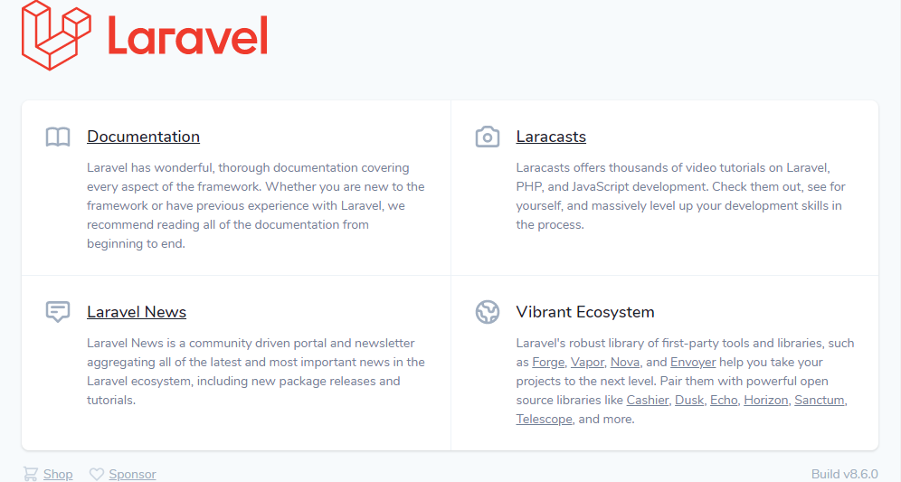

# docker-compose-laravel-lemp
## docker-compose で Laravel の開発環境をセットアップする方法（Window 10 Home バージョン 2004 より前）
このリポジトリでは、docker-compose を使って LEMP 環境（Linux, Nginx, MySQL, PHP）を構築し、Laravel をインストール、DB への接続を確認するまでの方法を説明する。

### セットアップ端末のバージョン
Windows 10 Home バージョン 1909
Docker Toolbox 
Docker 19.03.1
docker-machine 0.16.2
docker-compose 1.27.2

Windows 10 Home バージョン 2004 より前で Docker Toolbox を導入していない場合は、以下を参照する。

Docker Toolbox について：  
https://github.com/fs5013-furi-sutao/explain.how_to_install.docker_toolbox

### チュートリアルの流れ
このチュートリアルでは、以下の順番でコードを組み立てていく。
1. Nginx サーバーを立ち上げる
2. Nginx 上で PHP を動作させる
3. MySQL を用意する
4. Laravel をインストールする

このリポジトリをクローンした場合は、すぐに docker-compose コマンドでコンテナを起動できるので、上記ステップ 4 から Laravel のインストール作業を行う。

ステップ 1 ～ 3 は、そこまでのコンテナを揃える作業となる。

### ステップ 1 : Nginx サーバーを立ち上げる
このチュートリアルのゴールは、PHP の実行環境を構築し、Laravel をインストールすることなので、PHP を動作させる Web サーバーを Nginx で用意する必要がある。

まずは、以下の 3 つのファイルを用意し、Nginx による静的コンテンツ（index.html）配信サーバーを立ち上げる。
- default.conf
- docker-compose.yml
- index.html

ステップ 1 の作業を、このリポジトリでは `nginx` ブランチで行っている。

#### Nginx のコンテナ定義、設定ファイルを用意する
まずは、開発環境の起点となるディレクトリを mkdir コマンドで作成し、cd コマンドで作成したディレクトリ内に移動する。

以下のコマンドは Git Bash で実行する。

```console
mkdir ./docker-compose-laravel-lemp
cd ./docker-compose-laravel-lemp
```

以下の構成で各ファイル・ディレクトリを作成する。

リポジトリのフォルダ・ファイル構成:
```
.
├── docker/
│    └── web/
│         └── nginx.conf
├── docker-compose.yml
├── .env
└── index.html
```

以下のコマンドで、各フォルダ、ファイルを用意しておく。
```console
mkdir -p ./docker/web
touch ./docker/web/nginx.conf
touch ./docker-compose.yml
touch ./index.html
```

ここからは用意した各ファイルについて、その内容を確認していく。

##### docker-compose.yml 
ここでは、まず、Nginx の Docker コンテナの情報のみ記述する。

docker-compose.yml:
```yaml
version: '3.8'
services:
  web:
    image: nginx:alpine
    working_dir: /application
    volumes:
     - .:/application
     - ./docker/web/nginx.conf:/etc/nginx/conf.d/default.conf
    ports:
     - ${WEB_PORT}:80
```

各、設定内容は以下の通り。

###### version
docker-compose.yml のファイルフォーマットのバージョンを宣言する。

###### services
要素中の web は、コンテナの名前の定義であり、更にその１つ下の階層が、実行するコンテナの定義となる。

###### image
イメージ作成時にベースにする Docker イメージ（ここではDocker Hubで配布されている nginx の中でも最軽量な alpine イメージ）を指定する。

###### working_dir
コンテナの作業ディレクトリを設定する。

###### ports
ポートフォワーディングの指定で、ホスト側のポート:コンテナ側のポートの形式で記述する。ここでは、`8000:80` と記述しているので、ホスト側から ホストIP:8000 （例: 192.168.99.100:8000）にアクセスすると、コンテナ側の localhost（80はhttpのデフォルトポート）にアクセスできるようになる。

###### volumes
volumes は、ホスト・コンテナ間でのファイル共有の指定で、ホスト側のパス:コンテナ側のパスの形式で記述する。ここでは、ホスト側で編集した ./docker/web/nginx.conf がコンテナ側の /etc/nginx/conf.d/default.conf に反映され、さらに、ホスト側のルートディレクトリ（ここでは、作成したディレクトリ./docker-compose-laravel-lemp）の内容がホスト側の /application ディレクトリに反映される。

volumesを設定することでファイルやディレクトリは、永続化（コンテナを削除してもホスト側にファイルやディレクトリが残る）させることができる。

##### .env ファイルの作成
.env には、docker-compose で利用する環境変数を設定する。docker-compose ファイルと同階層のディレクトリに .env ファイルを置くと、docker-compose コマンド実行時に、そのファイルに記載された環境変数を読み込ませることができる。

.env:
```
WEB_PORT=8000
COMPOSE_CONVERT_WINDOWS_PATHS=1
```

ここでは docker-compose ファイル内で使用している変数 `WEB_PORT` の値を設定している。

`COMPOSE_CONVERT_WINDOWS_PATHS=1` については、この記述で Unix 形式のファイルパスを、実行時に Windows パスへの変換を自動で行うように設定している。

##### nginx.conf ファイルの作成
nginx.conf には、Nginx の設定内容を記述する。

nginx.conf:
```
server {
  listen 80 default;
  client_max_body_size 308M;
  access_log /var/log/nginx/application.access.log;
  root /application;
  index index.html;
}
```

各、設定内容は以下の通り。

###### listen
Web サーバがリクエストを受け付ける IP アドレスやポート番号を設定する。listen IP アドレス:ポート番号の形式で記述する。ここでは、IP アドレスを省略しており、デフォルトの設定として、すべての IP アドレスの 80 番ポートでリクエストを受け付ける。

###### root, index
それぞれ、ドキュメントルートのディレクトリ・インデックスとして使われるファイル名を設定する。

ここでは、リクエストの URI が/で終わっている（つまりディレクトリになっている）ときに、/application/（リクエストの URI ）/index.html をレスポンスとして返すように設定している。

###### access_log, error_log
それぞれ、アクセスログの出力先パス・エラーログの出力先パスを指定している。

#### Nginx の動作確認をする
Nginx の Docker コンテナの定義、Nginx の設定が済み、静的コンテンツを配信する Web サーバーを立ち上げる準備が整った。Nginx が動作していることを確認するための静的コンテンツとして、index.html を用意する。

index.html
```
<h1>docker-compose-laravel-lemp</h1>
<p>Served by Nginx</p>
```

ここまで準備できたら Kitematic を起動させ、./docker-compose-laravel-lemp ディレクトリで、Docker CLI から docker-compose コマンドを実行する。

```console
docker-compose up -d
```

docker-compose up コマンドは、docker-compose.yml の記述のとおりにコンテナを作成・開始するコマンドで、-d オプションをつけることでバックグラウンドでコンテナを実行させることができる。-d オプションをつけなかった場合、各コンテナのログが表示され続ける。

起動コンテナの ip アドレスを以下のコマンドで確認する。

```console
VBoxManage guestproperty enumerate "default" | findstr IP
```
実行結果例： 
```
Name: /VirtualBox/GuestInfo/Net/0/V4/IP, value: 10.0.2.15, timestamp: 1600540967070674800, flags:
Name: /VirtualBox/GuestInfo/Net/3/V4/IP, value: 172.18.0.1, timestamp: 1600541061902742200, flags:
Name: /VirtualBox/GuestInfo/Net/2/V4/IP, value: 172.17.0.1, timestamp: 1600540972067059103, flags:
Name: /VirtualBox/GuestInfo/Net/1/V4/IP, value: 192.168.99.100, timestamp: 1600540967071650804, flags:
```

上記の実行結果例では default VM の IP アドレス、つまり起動コンテナの IP アドレスは、`192.168.99.100` なので、docker-compose ファイルで設定したポート番号 `8000` を使って、ブラウザから Web サーバにリクエストを送る。

```
http://192.168.99.100:8000/
```

ここまでのコードは以下のブランチにコミットしている。

nginx ブランチ:  
https://github.com/fs5013-furi-sutao/docker-compose-laravel-lemp/tree/nginx

### ステップ 2 : Nginx 上で PHP を動作させる
「ステップ 1 : Nginx サーバーを立ち上げる」では、静的なコンテンツを配信する Web サーバを立ち上げた。ステップ 2 では、PHP-FPM を使って Nginx 上で PHP を動作させ、PHP の実行環境を構築する。

PHP-FPM とは何なのか、Nginx との関係などについては、以下を参照する。

Nginx と PHP-FPM の仕組み:  
https://github.com/fs5013-furi-sutao/explain.how_nginx_and_php_fpm_work

#### PHP-FPM のコンテナを定義する
以下の構成で各ファイル・ディレクトリを追加する。

リポジトリのフォルダ・ファイル構成:
```
.
├── docker/
│    ├── php/
│    │    ├── Dockerfile
│    │    └── php.ini
│    └── web/
│         └── nginx.conf
├── docker-compose.yml
├── .env
└── index.html
└── index.php
```

各ファイルの内容は、以下の通りに作成、更新する。

##### docker-compose.yml に PHP-FPM のコンテナ定義を追加
「ステップ 1 : Nginx サーバーを立ち上げる」で作成した docker-compose.yml を以下の通りに編集する。

docker-compose.yml:
```yaml
version: '3.8'
services:
  web:
    image: nginx:alpine
    working_dir: /application
    depends_on:
        - backend
    volumes:
     - .:/application
     - ./docker/nginx/nginx.conf:/etc/nginx/conf.d/default.conf
    ports:
     - ${WEB_PORT}:80

  backend:
    build: ./docker/php
    working_dir: /application
    volumes:
      # - ./backend-laravel:/application
      - .:/application
      - ./docker/php/php.ini:/usr/local/etc/php/php.ini
```

###### services に app を追加 Docker php:7.4-fpmを指定します。
まず、services に backend を追加。コンテナイメージは ./docker/php フォルダに置いた Dockerfile でビルドする。volumes も設定し、/application 配下のファイルやディレクトリを永続化させる。

これで、この docker-compose.yml は Web サーバを立ち上げるコンテナ（Nginx）と、PHP を動作させるコンテナ（ PHP-FPM ）の 2 つのコンテナを定義していることになる。

###### web に depends_on を追加
次に、web に depends_on を追加し、backend を設定する。depends_on は、サービスの依存関係を定義するオプション。ここでは、Nginx が PHP を実行するので、Nginx が PHP に依存しているということを定義している。

このように定義すると、コンテナ起動時に、サービスの依存関係を考慮してコンテナが起動するようになる。つまり、PHP コンテナが起動したあとに、Nginx コンテナが起動するようになる。

##### Dockerfile の作成
./docker/php フォルダに Dockerfile を作成し、PHP のコンテナイメージをビルドできるようにする。Dockerfile の内容は以下の通り。

Dockerfile:
```
FROM php:7.4-fpm
WORKDIR "/application"

# Composer install
RUN php -r "copy('https://getcomposer.org/installer', 'composer-setup.php');"
RUN php composer-setup.php
RUN php -r "unlink('composer-setup.php');"
RUN mv composer.phar /usr/local/bin/composer

ENV COMPOSER_ALLOW_SUPERUSER 1
ENV COMPOSER_HOME /composer
ENV PATH $PATH:/composer/vendor/bin

RUN apt-get update \
&& apt-get install -y \
git \
zip \
unzip \
vim 
RUN apt-get update \
&& apt-get install -y libpq-dev \
&& apt-get clean; rm -rf /var/lib/apt/lists/* /tmp/* /var/tmp/* /usr/share/doc/*
```

Laravel 8.x のインストール要件で `BCMath PHP Extension` が必要になるため、あらかじめビルド時に BCMath をインストールしておく。ここでパッケージ管理の Composer もインストールしておく。

また、コンテナの /usr/local/etc/php/ ディレクトリに配置する PHP の設定ファイル php.ini を以下の内容で作成しておく。

php.ini:
```
[Date]
date.timezone = "Asia/Tokyo"
[mbstring]
mbstring.internal_encoding = "UTF-8"
mbstring.language = "Japanese"
```

##### PHP を実行できるように Nginx を設定
Nginx の設定ファイル nginx.conf を編集して、PHP を実行できるように設定する。

default.conf:
```
server {
  listen 80 default;
  client_max_body_size 308M;
  access_log /var/log/nginx/application.access.log;
  root /application;
  index index.php;
  if (!-e $request_filename) {
    rewrite ^.*$ /index.php last;
  }
  location ~ \.php$ {
    fastcgi_pass backend:9000;
    fastcgi_index index.php;
    fastcgi_param SCRIPT_FILENAME $document_root$fastcgi_script_name;
    fastcgi_param PHP_VALUE "error_log=/var/log/nginx/application_php_errors.log";
    fastcgi_buffers 16 16k;
    fastcgi_buffer_size 32k;
    include fastcgi_params;
  }
}
```

###### index の設定を修正
まず、index の設定を修正する。インデックスページの設定を index.html から index.php に変更している。

インデックスページを複数設定した場合、ドキュメントルートのディレクトリにファイルが複数存在したとき、先に記述したファイルから優先してインデックスページに設定されるようになります。index.php と index.html が両方存在した場合、`index index.php index.html;` と記述すれば、index.php が優先してインデックスページに設定される。

PHP だけを実行できるようにするため、今回は index.php のみ設定している。

###### location を設定
次に、location で、URI ごとにどのファイルを配信するのかを設定している。

locationでは、Nginx が PHP-FPM にリクエストを渡すための設定をしている。詳細については、上で紹介した記事にて解説されているので、参照する。fastcgi_pass の backend:9000 についてだが、本来は 127.0.0.1:9000 のように設定するのだが、docker-compose ではすべてのサービス間に自動でリンクが張られており、backend のようなサービス名で設定することができる。9000 は PHP-FPM が起動するデフォルトのポート番号である。

#### PHP-FPM のコンテナの動作確認
PHP-FPM コンテナの定義、PHP を実行するための Nginx の設定が済み、Nginx で PHP を動作させる準備が整った。index.html と同じ階層に index.php を用意する。

index.php:
```
<h1>docker-compose-laravel-lemp</h1>
<p>Served by Nginx</p>
<?php phpinfo();?>
```

phpinfo() は PHP のバージョンなどの設定内容を出力する関数。

この状態で、先程と同様に docker-compose up -d コマンドを実行すれば、以下のような画面が表示される。まだ docker-compose up -d をしてそのままの状態であれば、一度 docker-compose down し、コンテナを停止・削除してから行う。

!(index.php をブラウザで表示)[./00.screen_capture/phpinfo_in_indexphp.png]

これで、Nginx で PHP を動作させ、それを確認することができた。

ここまでのコードは php ブランチにコミットしている。

php ブランチ：  
https://github.com/fs5013-furi-sutao/docker-compose-laravel-lemp/tree/php

### ステップ 3 ： MySQL コンテナを用意する
docker-compose.yml を下記の通り編集し、MySQLのコンテナを定義する。

#### docker-compose.yml への追記
./docker-compose.yml:
```yaml
version: '3.8'
services:
  web:
    image: nginx:alpine
    working_dir: /application
    depends_on:
     - backend
    volumes:
     - .:/application
     - ./docker/web/nginx.conf:/etc/nginx/conf.d/default.conf
    ports:
     - ${WEB_PORT}:80

  backend:
    build: ./docker/php
    working_dir: /application
    volumes:
      # - ./backend-laravel:/application
      - .:/application
      - ./docker/php/php.ini:/usr/local/etc/php/php.ini
  db:
    image: mysql:8.0
    working_dir: /application
    volumes:
      - .:/application
      - mysql-db-store:/var/lib/mysql
      - ./docker/db/logs:/var/log/mysql
      - ./docker/db/my.cnf:/etc/mysql/conf.d/my.cnf
      - ./docker/db/initdb:/docker-entrypoint-initdb.d
    environment:
      - MYSQL_ROOT_PASSWORD=${DB_ROOT_PASS}
      - MYSQL_DATABASE=${DB_NAME}
      - MYSQL_USER=${DB_USER}
      - MYSQL_PASSWORD=${DB_PASS}
      - TZ=${TZ}
    ports:
      - ${DB_PORT}:3306
    command: --innodb-use-native-aio=0

volumes:
  mysql-db-store:
```
###### environment
environment では、MySQL コンテナでの環境変数を設定している。MYSQL_DATABASE はイメージの起動時に作成するデータベースの名前、MYSQL_USER, MYSQL_PASSWORD は新規ユーザーの作成とそのユーザーのパスワードの設定、MYSQL_ROOT_PASSWORDはMySQL におけるルートユーザーである root アカウントのパスワードの設定です。

まず始めに root password が設定されるため、MYSQL_ROOT_PASSWORD を一番始めに記述しておく必要がある。

設定した環境変数の値を定義するために .env ファイルには以下の内容を追記しておく

.env:
```
WEB_PORT=8000

DB_ROOT_PASS=rootsecret
DB_NAME=laraveldb
DB_USER=fsedu
DB_PASS=secret
DB_PORT=13306
TZ=Asia/Tokyo

# Windows のパスを Linux 向けのパスに変換する
COMPOSE_CONVERT_WINDOWS_PATHS=1
```

###### volumes
トップレベルにある volumes は、mysql-db-store を サービス内で共通化して、他のコンテナからも参照できるようにするための設定である。

###### command
`docker-compose up` コマンドの実行時に実行したいコマンドを記述する。

ここで command オプションに記述した `--innodb-use-native-aio=0` は、aio（Linux カーネルの非同期 I/O ファイルシステム）の利用を指定するコマンドである。

共有フォルダでは aio がサポートされていないため、上記の指定をしないとログなどのファイル書き込み時に次のようなエラーが発生する。

発生の可能性があるエラーのメッセージ: 
```
File ./undo_001: 'aio write' returned OS error 122. Cannot continue operation.
```

#### 必要なフォルダとファイルの作成
```
.
├── docker/
│    ├── php/
│    │    ├── Dockerfile
│    │    └── php.ini
│    ├── db/
│    │    ├── initdb/
│    │    │    └── .gitkeep
│    │    ├── logs/
│    │    │    └── .gitkeep
│    │    └── my.cnf/
│    │         └── my.cnf
│    └── web/
│         └── nginx.conf
├── docker-compose.yml
├── .env
└── index.html
└── index.php
```
###### .gitkeep ファイル
.gitkeep ファイルは空フォルダをコミットさせるためのファイル。

空ファイルは、中にファイルが 1 つもないとコミットできない。つまり、ワーキングツリーにフォルダがあっても、リポジトリにはフォルダが存在しないことになってしまう。それを防ぐために、中に .gitkeep というファイル内に何も記述しないファイルを置いて置く。

空フォルダに奥ファイル名は .gitkeep にする必須ルールはないが、慣習的に .gitkeep という名前が広く使われている。ファイル名を .gitkeep にしておくことで、そうした慣習を知っている開発者に、空フォルダを残しておきたいという意図が伝わる。 

###### initdb フォルダ
DB コンテナの /docker-entrypoint-initdb.d にマウントする。ローカルのこのフォルダに sql ファイルを配置しておくことで、コンテナ起動時に sql ファイルに記述した sql が実行される。

###### my.cnf ファイル
MySQL の設定ファイル。内容は以下の要に記述する。

my.cnf: 
```
# MySQLサーバーへの設定
[mysqld]
# 文字コード/照合順序の設定
character-set-server = utf8mb4
collation-server = utf8mb4_0900_as_cs

# タイムゾーンの設定
default-time-zone = SYSTEM
log_timestamps = SYSTEM

# デフォルト認証プラグインの設定
default-authentication-plugin = mysql_native_password

# エラーログの設定
log-error = /var/log/mysql/mysql-error.log

# スロークエリログの設定
slow_query_log = 1
slow_query_log_file = /var/log/mysql/mysql-slow.log
long_query_time = 5.0
log_queries_not_using_indexes = 0

# 実行ログの設定
general_log = 1
general_log_file = /var/log/mysql/mysql-query.log

# mysqlオプションの設定
[mysql]
# 文字コードの設定
default-character-set = utf8mb4

# mysqlクライアントツールの設定
[client]
# 文字コードの設定
default-character-set = utf8mb4
```

#### MySQL コンテナの動作確認
docker-compose up -d したあと、下記のコマンドを実行することで、MySQL コンテナに入ることができる。

DB コンテナにログインするコマンド: 
```console
docker-compose exec db bash
```

コンテナに入ると、コマンドプロンプトが root@xxxxxxxxxxxx:/# のような状態に変化する。この状態で以下のコマンドを実行することで、MySQL に接続することができる。

MySQL にログインするコマンド: 
```console
mysql -h localhost -u fsedu -p
```

パスワードを求められるので、docker-compose.yml で環境変数に設定したパスワードを入力する。

MySQL が起動すると、コマンドプロンプトが mysql> に変化する。この状態で、以下のコマンドを実行することで、データベースの一覧を確認することができる。

```console
show databases;
```

実行結果例:
```
+--------------------+
| Database           |
+--------------------+
| information_schema |
| laraveldb          |
+--------------------+
2 rows in set (0.00 sec)
```

MySQL コンソールを終了するには、quit コマンドを実行する。

MySQL コンソールを終了:
```console
quit
```

想定通り、docker-compose.yml の environment で設定した DB 名である laraveldb が作成されていることが確認できる。これで、MySQL の起動・データベースの作成ができたことが確認できた。

ここまでのコードは mysql ブランチにコミットしている。

php ブランチ：  
https://github.com/fs5013-furi-sutao/docker-compose-laravel-lemp/tree/mysql

### ステップ 4 : Laravel をインストールする
このリポジトリをクローンすると次のようなベースライン構成となる。

リポジトリのベースライン構成:
```
.
├── docker/
│    ├── php/
│    ├── db/
│    └── web/
│         └── nginx.conf
├── docker-compose.yml
├── .env
└── index.html
└── index.php
```

#### 不要ファイルの削除
まず、index.html と index.php の 2 つのファイルは Laravel の開発には不要なので削除しておく。つまり、以下のようなディレクトリ、ファイル構成となる。

```
.
├── docker/
│    ├── php/
│    ├── db/
│    └── web/
│         └── nginx.conf
├── docker-compose.yml
└── .env
```

#### Laravel アプリケーションの作成
次に Composer を利用して php コンテナ内に Laravel アプリケーションを作成する。

Docker CLI で次のコマンドを実行して、php コンテナにログインする。

```console
docker-compose exec backend bash
```

続いて、次のコマンドで Laravel アプリケーションを作成する。

```console
composer create-project laravel/laravel backend-laravel --prefer-dist
```

これで backend-laravel ディレクトリ内に Laravel アプリケーションができた。

```
.
├── docker/
│    ├── php/
│    ├── db/
│    └── web/
│         └── nginx.conf
├── backend-laravel/
├── docker-compose.yml
└── .env
```

##### volumes パスの修正
次に、作成された新しいパスに合うように docker-compose.yml ファイルを調整する必要がある。

docker-compose.yml を開き、次のコードブロックのように、backend ボリュームタグを新しいパスで調整する。

docker-compose.yml（backend サービス部分）:
```yaml
  backend:
    build: ./docker/php
    working_dir: /application
    volumes:
       - ./backend-laravel:/application
      # - .:/application
      - ./docker/php/php.ini:/usr/local/etc/php/php.ini
```

##### Nginx 設定の修正
そして、Nginx の root 設定を /application ディレクトリから /application/public ディレクトリに変更する。

nginx.conf
```
server {
  // ・・・
  root /application/public;
  // ・・・
  }
  // ・・・
}
```

##### コンテナの再起動
引き続きターミナルで、「exit」と入力して backend bash からログアウトする。

続いて、次のコマンドでコンテナを停止する。

```console 
docker-compose kill
```

さらに次のコマンドでコンテナを再起動する

```console
docker-compose up -d
```

コンテナが起動したらブラウザを開き、Laravel のウェルカムページが表示されることを確認する。

http://192.168.99.100:8000/



#### Laravel アプリケーションの .env ファイルの設定

プロジェクトフォルダーのルートにある .env ファイルを開き、次のようにデータベース構成を DB コンテナの設定値に書き換える。

/backend-laravel/.env:
```
DB_CONNECTION=mysql 
DB_HOST=db 
DB_PORT=3306 
DB_DATABASE=laraveldb 
DB_USERNAME=fseu 
DB_PASSWORD=secret
```

#### アプリから DB への接続確認
接続を確認してみる。Docker CLI で次のコマンドを実行して、php コンテナにログインする。

```console
docker-compose exec backend bash
```

backend bash 内で次のコマンドを実行する。

```console
php artisan tinker
```

tinker は Laravel を対話的に動かすことができるコマンドであり、次のコードをコマンドで実行することで DB に接続することができる。

```console
DB::connection() -> getDatabaseName();
```

実行結果例:
```
=> "laraveldb"
```

DB に接続し、データベース名を取得することができた。これで Laravel で開発を進める準備ができた。
